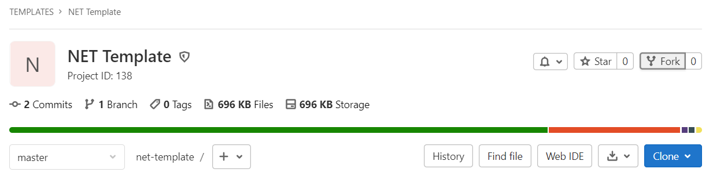
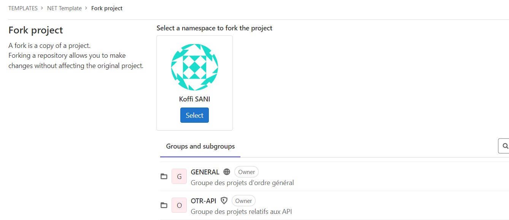

ToDo

# Template des applications internes de l'OTR

[](https://gitlab.otr.lan/templates/net-template/main/-/commits/master)

## Introduction

Dans le but de standardiser les développements internes et rendre stable les activités de développement logiciel, il est important de faire certains efforts. 
Après étude, nous convenons de mettre en place ce modèle dont nous nous servirons pour les projets à venir.

## Exigences

Le template se base sur les outils techniques suivants:

| Outils      | Version |
|-------------|---------|
| dotnet      | 6.0     |
| C#          | 10      |

## Prise en main

### *Forker* le projet

- Au démarrage du projet, il suffit de créer un fork du template dans le namespace adéquat en cliquant sur le bouton `Fork`:

- Puis, sur la page suivante, choisir le namespace, ceci crée le projet dans ce namespace :

- Cloner le projet en local et procéder aux configurations nécessaires au développement.

### Installer les outils

- Installer dotnet Core (voir [Site Officiel](https://dotnet.microsoft.com/en-us/download))
- Vérifier la version de dotnet core installée :

```bash
dotnet --version
```

- Installer Git (voir [Site officiel](https://git-scm.com)))
- Cloner le projet et basculer dans le dossier `main` :

```bash
git clone git@gitlab.otr.lan:DCCFE/enr/main.git
cd main/
```


- Installer Entity Framework

```
dotnet tool install --global dotnet-ef
```

### Configurations
- Ouvrir la solution
- Configurer les paramètres du projet
  * Dupliquer le fichier de configuration `src/Server/appsettings.json.default` et le renommer
    en `src/Server/appsettings.json`
  * Spécifier les paramètres de la base de données : remplacer `<SERVER_ADDRESS_INSTANCE>` et `<DATABASE_NAME>` par
    leurs valeurs respectives.
  * Effectuer les migrations (se déplacer dans le projet `Server` et exécuter :


  ```
  dotnet ef database update
  ```

### Exécuter

Sur visual Studio, ouvrir la solution puis cliquer sur le bouton Exécuter.

Aussi, dans la racine de la solution, exécuter la commande suivante :

```bash
dotnet run
```

## Contributeurs

- ANYILUNDA Anne-Marie [@aanylunda](https://gitlab.otr.lan/aanyilunda)
- MISSITE Diana [@Diana](https://gitlab.otr.lan/Diana)
- NAPO Gbati [@ishak08](https://gitlab.otr.lan/ishak08)
- SANI Koffi [@koffisani](https://gitlab.otr.lan/koffisani)
- WOAGOU Daniel [@pwoagou](https://gitlab.otr.lan/pwoagou)

## Comment contribuer

Les contributions à ce projet sont très appréciées. Elles sont normalement de plusieurs ordres. Loin de consister
seulement en développement (écriture de code), il peut s'agit aussi de signaler un bug sur l'application.

Pour une contribution qui consiste en écriture de code, suivre les étapes suivantes.

- Cloner le projet;
- Basculer sur la branche `Develop` et créer une branche sur laquelle travailler:

```bash
git checkout -b <nom_branche>
```

- Ajout du code concernant la fonctionnalité à développer et faire le commit;
- Effectuer le push sur le remote:

```bash
git push -u origin <nom_branche>
```

- Ouvrir un merge request avec sa branche et vers `Develop` comme destination.

Lorsqu'il s'agit de signaler un bug, il faut procéder comme suit :

- Créer un ticket en visitant la page Issues
- Renseigner le titre du ticket, fournissant des informations sommaires pour le ticket;
- Fournir des détailsdans le champ description;
  * Résumé (Résumez de manière précise le bug)
  * Etapes pour reproduire (Comment peut-on reproduire cette situation - ceci est très important)
  * Projet Modèle (Si possible, créer un modèle de projet ici sur le serveur gitlab.otr.lan qui fait ressortir le
    comportement de l'application et ajouter son lien ici.)
  * Quel est le comportement actuel ? (Ce qui se passe actuellement)
  * Quel est le comportement attendu ? (Ce qu'on devrait observer plutôt)
  * Log utile ou capture d'écran (Coller toute portion de fichier - utiliser des blocs de code (```) pour formatter
    l'affichage - de logs, et de code, pour faciliter la lecture.)
  * Possibles solutions (Si possible, proposer des solutions pour remédier)